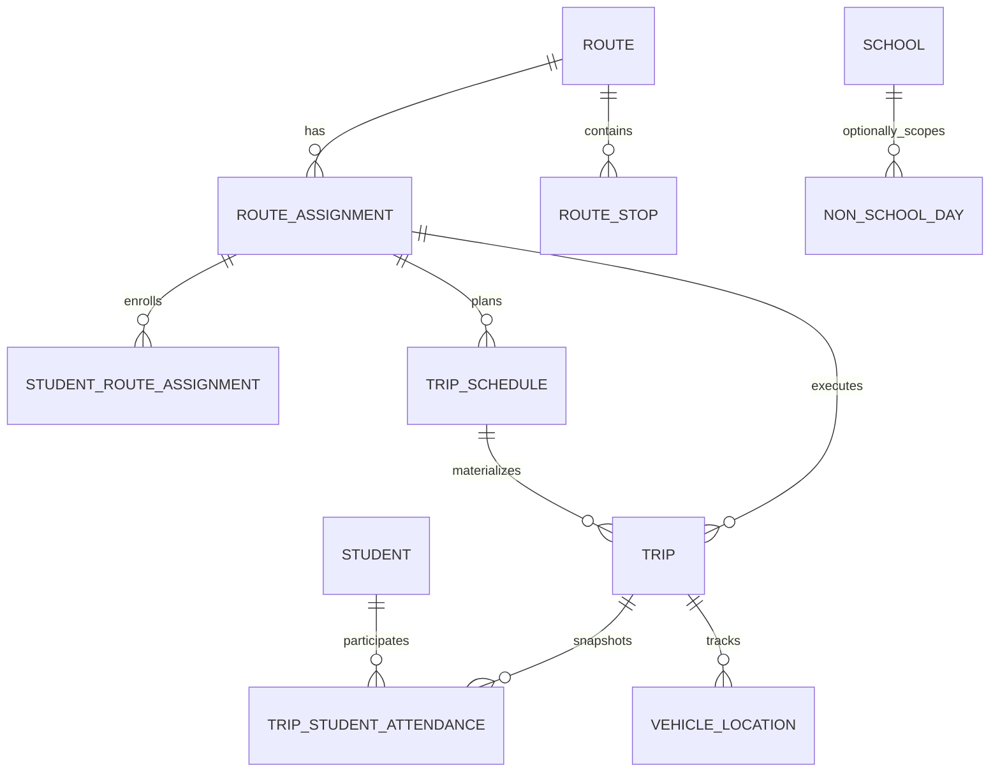

# Propuesta de rediseño operativo de viajes escolares

## 1. Propósito

Este documento diseña la siguiente evolución del módulo de transporte antes de implementar cambios. La propuesta conserva Clean Architecture, CQRS con MediatR, repositorios, DTOs manuales y las reglas de visibilidad existentes.

No se modifica código ni base de datos como parte de este análisis.

## 2. Problema actual

El modelo actual permite crear una ruta, asignarle recursos y estudiantes, iniciar un viaje, registrar GPS y finalizar o cancelar. Esa base es útil, pero todavía representa una ejecución técnica, no la operación escolar completa.

### Limitaciones confirmadas

1. `RouteAssignment` no tiene estado ni vigencia propios. Una asignación se considera operativa si su `Route` está activa.
2. `Trip` se crea al iniciar y pasa inmediatamente de `Pending` a `InProgress`. No existe una instancia planificada visible antes de la salida.
3. `Trip` solo conserva `StartTime`, `EndTime` y `Status`. No registra hora programada, dirección, atraso, razón de cancelación ni desvío.
4. Los pasajeros históricos se consultan desde la lista mutable de `RouteAssignment`. No queda congelado quién debía viajar en una instancia concreta.
5. Se pueden remover estudiantes de una asignación aunque exista un viaje activo.
6. No hay calendario escolar ni control de fines de semana.
7. No hay representación de días sin operación ni justificación de suspensión.
8. `Cancel()` permite cancelar un viaje `InProgress`, contrario a la nueva regla requerida.
9. No existe una política de inicio anticipado.
10. Driver y assistant pueden reportar GPS, pero no existe un flujo explícito para que el assistant ejecute transiciones operativas.
11. No hay trazabilidad de desvíos de ruta.

### Observación sobre el síntoma “viaje finalizado al iniciar”

En el dominio actual, `RouteAssignment.StartTrip()` crea un `Trip`, llama `trip.Start()` y deja `Status = InProgress`. No debería quedar `Completed`.

Antes de implementar el rediseño conviene reproducir el síntoma desde HTTP y revisar:

- mapeo de `TripStatus` en DTOs y frontend;
- representación visual de valores enum;
- consultas que interpretan `EndTime`;
- datos históricos existentes;
- conversiones EF, porque `TripStatus` se persiste como texto.

El nuevo modelo debe reforzar esta transición con pruebas de dominio, Application y API.

## 3. Lógica ideal propuesta

### Idea central

Separar cuatro capas operativas:

1. **Ruta:** recorrido y paradas.
2. **Asignación:** recursos y estudiantes vigentes para operar una ruta.
3. **Programación:** regla recurrente de viajes de entrada o salida.
4. **Viaje planificado:** instancia concreta de una fecha, con horarios programados, ejecución real y snapshot de pasajeros.

### Flujo ideal

1. Se crea y activa una `Route` con sus paradas.
2. Se crea una `RouteAssignment` activa, con vigencia, vehículo, conductor y assistant opcional.
3. Se crea uno o más `TripSchedule`:
   - `ToSchool`, por ejemplo 07:00;
   - `FromSchool`, por ejemplo 14:00.
4. El sistema genera o materializa viajes planificados para una fecha de clase.
5. Si la fecha es fin de semana o `NonSchoolDay`, el viaje no se inicia. Debe quedar registro de no operación con motivo.
6. Driver, assistant, Admin o Supervisor inicia un viaje planificado cuando corresponde.
7. Al iniciar:
   - se valida tolerancia de salida anticipada;
   - se valida calendario;
   - se valida assignment activo y recursos operativos;
   - se congela la lista de estudiantes;
   - el estado queda `InProgress`;
   - se calcula atraso.
8. Driver o assistant registra GPS durante el viaje.
9. Si hay desvío, se registra razón y actor.
10. Driver, assistant, Admin o Supervisor finaliza el viaje.
11. Un viaje planificado solo puede cancelarse antes de iniciar y con razón obligatoria.

## 4. Modelo de datos propuesto



### Entidades existentes que deben evolucionar

#### RouteAssignment

Agregar:

| Campo | Tipo | Propósito |
|---|---|---|
| `Status` | `AssignmentStatus` | Separar vigencia operativa del estado de `Route`. |
| `ValidFrom` | `DateOnly` | Inicio de vigencia. |
| `ValidTo` | `DateOnly?` | Fin opcional de vigencia. |

Reglas:

- Solo assignments `Active` participan en conflictos de horario y generación de viajes.
- No iniciar viajes desde assignments `Suspended`, `Completed` o `Cancelled`.
- No remover estudiantes si existe un viaje `InProgress`.
- No eliminar físicamente assignments con historial.

#### Trip

Renombrar conceptualmente:

| Campo actual | Campo propuesto |
|---|---|
| `StartTime` | `ActualStartTime` |
| `EndTime` | `ActualEndTime` |

Agregar:

| Campo | Tipo | Requerido | Propósito |
|---|---|---|---|
| `TripScheduleId` | `Guid?` | No | Origen recurrente; permite viajes excepcionales manuales. |
| `OperationDate` | `DateOnly` | Sí | Día escolar al que pertenece el viaje. |
| `ScheduledDepartureTime` | `DateTimeOffset` | Sí | Instante planificado de salida. |
| `ScheduledArrivalTime` | `DateTimeOffset?` | No | Instante planificado de llegada. |
| `ActualStartTime` | `DateTimeOffset?` | No | Inicio real. |
| `ActualEndTime` | `DateTimeOffset?` | No | Final real. |
| `Direction` | `TripDirection` | Sí | Entrada o salida escolar. |
| `Status` | `TripStatus` | Sí | Estado operativo. |
| `CancellationReason` | `string?` | Condicional | Obligatorio si `Status = Cancelled`. |
| `NonOperationReason` | `TripNonOperationReason?` | Condicional | Categoría cuando no habrá viaje. |
| `NonOperationNotes` | `string?` | Condicional | Justificación concreta. |
| `RouteDeviationReason` | `string?` | No | Razón del desvío reportado. |
| `RouteDeviationReportedAt` | `DateTimeOffset?` | No | Momento del reporte. |
| `RouteDeviationReportedByUserId` | `Guid?` | No | Actor responsable. |

Propiedad calculada:

```text
DelayMinutes = max(0, ActualStartTime - ScheduledDepartureTime)
```

Recomendación: calcular `DelayMinutes` en dominio y exponerlo en DTO. Persistirlo solo si reportes históricos o analítica requieren congelar el valor exacto aplicado en ese momento.

### Nuevas entidades

#### TripSchedule

Representa la programación recurrente de un assignment.

| Campo | Tipo | Propósito |
|---|---|---|
| `Id` | `Guid` | PK. |
| `RouteAssignmentId` | `Guid` | Assignment operativo. |
| `Direction` | `TripDirection` | `ToSchool` o `FromSchool`. |
| `DepartureTime` | `TimeOnly` | Hora local programada. |
| `ArrivalTime` | `TimeOnly?` | Hora local estimada. |
| `DaysOfWeek` | colección o flags | Días recurrentes; normalmente lunes a viernes. |
| `IsActive` | `bool` | Permite suspender programación sin borrarla. |
| `ValidFrom` | `DateOnly` | Inicio de vigencia. |
| `ValidTo` | `DateOnly?` | Fin opcional. |

Índices recomendados:

- `(RouteAssignmentId, Direction, ValidFrom)`;
- índice para schedules activos;
- validación de solapamiento de vigencias en handler.

#### NonSchoolDay

Representa un día sin clases o sin operación escolar.

| Campo | Tipo | Propósito |
|---|---|---|
| `Id` | `Guid` | PK. |
| `Date` | `DateOnly` | Fecha no lectiva. |
| `SchoolId` | `Guid?` | `null` para aplicar globalmente o escuela específica. |
| `ReasonType` | `NonSchoolDayReason` | Feriado, suspensión, clima u otro. |
| `Reason` | `string` | Justificación visible. |
| `IsActive` | `bool` | Permite corregir calendario sin borrar historial. |

Índice recomendado:

- único `(Date, SchoolId)` para evitar duplicados equivalentes.

#### TripStudentAttendance

Se recomienda usar este nombre en lugar de `TripPassengerSnapshot`, porque permite evolucionar desde snapshot hacia abordaje, descenso y ausencia.

| Campo | Tipo | Propósito |
|---|---|---|
| `TripId` | `Guid` | Viaje. |
| `StudentId` | `Guid` | Estudiante histórico. |
| `StudentNameSnapshot` | `string` | Nombre al momento del viaje. |
| `StudentCodeSnapshot` | `string` | Código al momento del viaje. |
| `GuardianIdSnapshot` | `Guid?` | Tutor relacionado al momento del viaje. |
| `GuardianNameSnapshot` | `string?` | Nombre histórico del tutor. |
| `Status` | `TripAttendanceStatus` | Esperado, abordó, ausente, descendió. |
| `BoardedAt` | `DateTimeOffset?` | Evolución futura. |
| `DroppedOffAt` | `DateTimeOffset?` | Evolución futura. |
| `Notes` | `string?` | Observaciones. |

PK recomendada: `(TripId, StudentId)`.

Al iniciar el viaje se crea una fila por estudiante actualmente asignado. Las consultas históricas y visibilidad Guardian deben usar este snapshot cuando exista.

### Entidad opcional para una fase posterior

#### TripStatusHistory

No es imprescindible para la primera implementación, porque ya existe auditoría. Puede agregarse si se necesita una línea de tiempo operativa fácil de consultar:

- `TripId`;
- estado anterior;
- estado nuevo;
- fecha;
- usuario;
- motivo.

## 5. Enums nuevos y cambios de enums

### TripDirection

```text
ToSchool
FromSchool
```

### AssignmentStatus

```text
Draft
Active
Suspended
Completed
Cancelled
```

### TripStatus recomendado

```text
Scheduled
InProgress
Completed
Cancelled
NotOperating
```

Decisión recomendada: migrar el valor existente `Pending` a `Scheduled`. Si mantener compatibilidad temporal es más seguro, conservar `Pending` como alias transitorio y retirarlo después.

### TripAttendanceStatus

```text
Expected
Boarded
Absent
DroppedOff
```

Para la primera fase basta crear snapshots con `Expected`.

### NonSchoolDayReason

```text
Holiday
SchoolSuspension
Weather
Administrative
Other
```

### TripNonOperationReason

```text
NonSchoolDay
Weekend
Suspension
Weather
VehicleUnavailable
DriverUnavailable
Other
```

## 6. Respuestas a decisiones clave

### ¿Conviene crear SchoolCalendar o NonSchoolDay?

Sí. Para el alcance inmediato conviene crear `NonSchoolDay`.

Es más simple que modelar un calendario académico completo y cubre feriados, suspensiones y clima. Puede pertenecer a una escuela o aplicar globalmente. Un `SchoolCalendar` más amplio puede incorporarse después si se necesitan períodos lectivos, vacaciones o ciclos académicos.

### ¿Conviene crear TripSchedule?

Sí. Es necesario para representar viajes diarios recurrentes, dirección y hora programada. Guardar estas reglas solamente en `Route.OperatingHours` ya no es suficiente.

### ¿Conviene crear TripStudentAttendance?

Sí, y es crítico. Debe congelar pasajeros al iniciar. También deja preparada la evolución hacia asistencia real, abordaje y descenso.

### ¿Conviene agregar AssignmentStatus a RouteAssignment?

Sí. Es necesario separar:

- ruta disponible;
- equipo operativo vigente;
- assignment suspendido;
- assignment histórico.

## 7. Reglas de negocio propuestas

### Programación

1. Cada `TripSchedule` pertenece a un assignment.
2. Cada schedule define una sola dirección.
3. `DepartureTime` es obligatorio.
4. Si existe `ArrivalTime`, debe ser posterior a `DepartureTime`.
5. Solo schedules activos y vigentes generan viajes.
6. Los viajes deben materializarse como `Scheduled` antes de comenzar.

### Inicio de viaje

1. Solo iniciar viajes `Scheduled`.
2. El assignment debe estar `Active` y vigente.
3. La ruta debe estar `Active` y tener stops.
4. Conductor, vehículo y assistant opcional deben estar activos.
5. Debe existir al menos un estudiante asignado.
6. No iniciar fines de semana.
7. No iniciar si existe `NonSchoolDay` aplicable.
8. No iniciar antes de `ScheduledDepartureTime - Trips.EarlyStartToleranceMinutes`.
9. Admin o Supervisor pueden forzar inicio anticipado dejando auditoría y razón.
10. No permitir dos viajes `InProgress` para el mismo assignment.
11. Al iniciar, crear snapshots `TripStudentAttendance`.
12. Al iniciar, establecer `ActualStartTime` y `Status = InProgress`.
13. Calcular `DelayMinutes`.

### Finalización

1. Solo finalizar viajes `InProgress`.
2. Establecer `ActualEndTime`.
3. Establecer `Status = Completed`.
4. Driver, assistant asignado, Admin o Supervisor pueden finalizar.

### Cancelación y no operación

1. Solo cancelar viajes `Scheduled`.
2. No cancelar viajes `InProgress`.
3. `CancellationReason` es obligatorio.
4. Para fin de semana, día sin clase o suspensión, registrar `NotOperating`, categoría y justificación.
5. La no operación puede generarse automáticamente desde calendario, pero debe quedar consultable.

### Desvíos

1. Driver, assistant asignado, Admin o Supervisor pueden reportar desvío.
2. `RouteDeviationReason` es obligatorio.
3. Registrar usuario y timestamp.
4. Auditar y notificar a Supervisor.
5. El tracking sigue funcionando; los puntos GPS permiten analizar el recorrido real.

### Estudiantes

1. No remover estudiantes de un assignment si tiene trip `InProgress`.
2. Los cambios de assignment solo afectan viajes futuros.
3. Los viajes iniciados conservan snapshots históricos.

### Tracking

1. Mantener la regla actual: solo registrar GPS para viajes `InProgress`.
2. Mantener acceso de Driver y assistant asignado.
3. Mantener acceso global de Admin y Supervisor.
4. Guardian consulta tracking si su estudiante aparece en el snapshot del viaje o, durante transición, en el assignment.

## 8. División de responsabilidades

### Reglas que deben vivir en dominio

En `Trip`:

- transición `Scheduled -> InProgress`;
- transición `InProgress -> Completed`;
- transición `Scheduled -> Cancelled`;
- transición `Scheduled -> NotOperating`;
- razón obligatoria al cancelar o marcar no operación;
- cálculo de atraso;
- registro justificado de desvío;
- prohibición de cancelar `InProgress`.

En `RouteAssignment`:

- estado y transiciones de assignment;
- vigencia coherente;
- capacidad;
- duplicado de estudiante;
- bloqueo de remoción cuando la colección cargada contiene trip activo;
- creación de snapshot o método que exponga estudiantes para snapshot.

En `TripSchedule`:

- horario válido;
- dirección;
- vigencia;
- días configurados.

En `TripStudentAttendance`:

- transiciones de asistencia si se implementan.

### Reglas que deben vivir en handlers o servicios de Application

- usuario autorizado para iniciar, finalizar, cancelar o reportar desvío;
- excepción Admin/Supervisor para inicio anticipado;
- lectura de setting `Trips.EarlyStartToleranceMinutes`;
- consulta de `NonSchoolDay`;
- validación de fin de semana;
- conflictos de schedule y recursos contra repositorios;
- generación/materialización de viajes;
- creación masiva de snapshots;
- auditoría y notificaciones;
- traducción de concurrencia a errores controlados.

### Reglas que debe reforzar Infrastructure

- índices únicos;
- FKs explícitas;
- `RowVersion` o token de concurrencia para `Trip` y `RouteAssignment`;
- transacción al iniciar viaje y crear snapshots;
- restricción o índice filtrado para evitar múltiples viajes `InProgress` cuando el proveedor lo permita.

## 9. Endpoints propuestos

### Endpoints existentes que deben cambiar

#### `POST /api/trips/start`

Hoy recibe:

```json
{
  "routeAssignmentId": "guid"
}
```

Propuesta:

```json
{
  "tripId": "guid",
  "earlyStartReason": null
}
```

Debe iniciar un viaje previamente planificado. Durante una transición controlada puede aceptarse temporalmente `routeAssignmentId`, materializar el trip del día y devolver advertencia de deprecación.

#### `PUT /api/trips/{id}/end`

Mantener ruta. Ajustar autorización para permitir Driver, assistant asignado, Admin y Supervisor.

#### `PUT /api/trips/{id}/cancel`

Mantener ruta, pero agregar body obligatorio:

```json
{
  "reason": "Clases suspendidas por condiciones climáticas"
}
```

Solo acepta viajes `Scheduled`.

#### `DELETE /api/route-assignments/{assignmentId}/students/{studentId}`

Mantener ruta. Bloquear si existe viaje `InProgress`.

### Endpoints nuevos necesarios

#### Programación

```text
POST   /api/route-assignments/{assignmentId}/schedules
GET    /api/route-assignments/{assignmentId}/schedules
PUT    /api/route-assignments/{assignmentId}/schedules/{scheduleId}
DELETE /api/route-assignments/{assignmentId}/schedules/{scheduleId}
```

#### Viajes planificados

```text
POST /api/trips/materialize
GET  /api/trips/scheduled?date=2026-06-01
GET  /api/trips/by-date?date=2026-06-01
PUT  /api/trips/{id}/not-operating
PUT  /api/trips/{id}/route-deviation
GET  /api/trips/{id}/passengers
```

`POST /api/trips/materialize` debe ser Admin/Supervisor o job interno. Genera instancias desde schedules activos para un rango corto.

Ejemplo de no operación:

```json
{
  "reasonType": "Weather",
  "notes": "Suspensión preventiva por lluvias intensas"
}
```

Ejemplo de desvío:

```json
{
  "reason": "Calle principal cerrada por obras"
}
```

#### Calendario escolar

```text
POST   /api/non-school-days
GET    /api/non-school-days?startDate=...&endDate=...
GET    /api/non-school-days/{id}
PUT    /api/non-school-days/{id}
DELETE /api/non-school-days/{id}
```

### Endpoints que pueden permanecer iguales

```text
GET  /api/trips
GET  /api/trips/{id}
GET  /api/trips/by-status/{status}
GET  /api/trips/by-date-range
GET  /api/trips/active/by-route-assignment/{routeAssignmentId}
POST /api/tracking/location
GET  /api/tracking/trips/{tripId}/current-location
GET  /api/tracking/trips/{tripId}/history
GET  /api/tracking/active-trips
GET  /api/tracking/my-students
```

Sus DTOs y queries deben incorporar dirección, horarios programados, atraso y snapshot cuando aplique.

## 10. Repositories y servicios requeridos

### ITripRepository

Agregar métodos conceptuales:

```text
GetScheduledByIdAsync
GetByDateAsync
GetScheduledByDateAsync
HasInProgressTripAsync
AddRangeAsync
SaveChangesAsync
```

### ITripScheduleRepository

```text
AddAsync
GetByIdAsync
GetByAssignmentAsync
GetActiveForDateAsync
HasOverlapAsync
SaveChangesAsync
```

### INonSchoolDayRepository

```text
AddAsync
GetByIdAsync
GetByDateRangeAsync
ExistsForDateAsync(date, schoolId)
SaveChangesAsync
```

### ITripStudentAttendanceRepository

```text
AddRangeAsync
GetByTripAsync
GuardianCanAccessTripAsync
SaveChangesAsync
```

### Servicio recomendado

`ITripPlanningService`:

```text
MaterializeTripsAsync(startDate, endDate)
MarkNonOperatingTripsAsync(date)
```

Este servicio coordina calendario, schedules y generación idempotente. Debe existir un índice único que impida duplicar instancias:

```text
(TripScheduleId, OperationDate)
```

## 11. Settings nuevos

Agregar al seeder de `SystemSettings`:

| Key | Default | Uso |
|---|---:|---|
| `Trips.EarlyStartToleranceMinutes` | `10` | Ventana de inicio anticipado permitida. |
| `Trips.MaterializationDaysAhead` | `7` | Horizonte de generación de viajes. |
| `Trips.AllowWeekendOperations` | `false` | Excepción futura para operación especial. |
| `Trips.RequireRouteDeviationReason` | `true` | Justificación obligatoria. |

No requieren columnas nuevas por sí mismos.

## 12. Migraciones requeridas

Se recomienda una migración principal:

```text
RedesignTripOperations
```

Debe incluir:

1. Nuevas tablas:
   - `TripSchedules`;
   - `NonSchoolDays`;
   - `TripStudentAttendances`.
2. Nuevas columnas en `RouteAssignments`:
   - `Status`;
   - `ValidFrom`;
   - `ValidTo`;
   - opcionalmente `RowVersion`.
3. Nuevas columnas en `Trips`:
   - programación;
   - dirección;
   - razones;
   - desvío;
   - opcionalmente `RowVersion`.
4. Renombre o migración de:
   - `StartTime -> ActualStartTime`;
   - `EndTime -> ActualEndTime`;
   - `Pending -> Scheduled`.
5. Índices y FKs explícitas:
   - `(TripScheduleId, OperationDate)` único;
   - `(TripId, StudentId)` PK compuesta;
   - índices por fecha, estado, assignment y dirección.

### Estrategia para datos existentes

1. Mantener trips históricos existentes.
2. Copiar `StartTime` y `EndTime` a campos reales.
3. Para trips históricos sin schedule:
   - `TripScheduleId = null`;
   - inferir `OperationDate` desde `ActualStartTime` o `CreatedAt`;
   - inferir dirección solo si es seguro; de lo contrario usar una migración transitoria con valor por revisar.
4. No generar snapshots retroactivos falsos. Marcar históricos anteriores al rediseño como “snapshot no disponible”.

## 13. Impacto en frontend

### Nuevas pantallas

1. Programación de viajes por assignment.
2. Calendario de días sin clase.
3. Bandeja de viajes del día:
   - programados;
   - en progreso;
   - completados;
   - cancelados;
   - sin operación.
4. Detalle de viaje con:
   - dirección;
   - horario programado;
   - horario real;
   - atraso;
   - razón de cancelación;
   - razón de desvío;
   - pasajeros congelados;
   - tracking.

### Cambios de UX

- Mostrar badges separados para estado y dirección.
- Mostrar alerta si el usuario intenta iniciar demasiado temprano.
- Pedir razón en modal antes de cancelar o reportar desvío.
- Deshabilitar “remover estudiante” mientras haya viaje activo.
- Permitir al assistant iniciar, finalizar y reportar desvío cuando corresponda.
- Mostrar atraso en minutos y diferencia entre hora planificada y real.
- Para Guardian, mostrar viajes relacionados mediante snapshot histórico.

### Compatibilidad

Los DTOs de `Trip` deben evolucionar sin exponer entidades de dominio. Conviene agregar campos manteniendo temporalmente aliases de `StartTime` y `EndTime` si el frontend actual aún los consume.

## 14. Autorización propuesta

| Operación | Admin | Supervisor | Driver asignado | Assistant asignado | Guardian |
|---|---|---|---|---|---|
| Consultar viajes generales | Sí | Sí | Solo propios | Solo propios | Solo relacionados |
| Iniciar viaje | Sí | Sí | Sí | Sí | No |
| Forzar inicio anticipado | Sí | Sí | No | No | No |
| Finalizar viaje | Sí | Sí | Sí | Sí | No |
| Cancelar viaje programado | Sí | Sí | Según política | Según política | No |
| Reportar desvío | Sí | Sí | Sí | Sí | No |
| Registrar GPS | Sí | Sí | Sí | Sí | No |
| Gestionar calendario | Sí | Sí | No | No | No |
| Gestionar schedules | Sí | Sí | No | No | No |

Recomendación: en primera implementación, restringir cancelación a Admin/Supervisor. Si la operación real exige cancelación por conductor o assistant, habilitarla con auditoría y notificación.

## 15. Pruebas que deben agregarse

### Domain tests

#### Trip

- inicia `Scheduled -> InProgress`;
- no inicia `Cancelled`, `Completed` ni `NotOperating`;
- finaliza `InProgress -> Completed`;
- no finaliza si no está en progreso;
- cancela `Scheduled -> Cancelled` con razón;
- rechaza cancelación sin razón;
- rechaza cancelación `InProgress`;
- calcula atraso correctamente;
- registra desvío solo con razón.

#### RouteAssignment

- activa, suspende y completa mediante transiciones válidas;
- rechaza remover estudiante si tiene trip activo;
- mantiene capacidad y duplicados.

#### TripSchedule

- rechaza arrival anterior a departure;
- valida dirección y vigencia.

### Application tests

- bloquea inicio fines de semana;
- bloquea inicio en `NonSchoolDay`;
- bloquea inicio demasiado temprano para Driver;
- permite override temprano para Admin/Supervisor con razón;
- congela snapshots al iniciar;
- impide snapshots duplicados por reintento;
- bloquea segundo trip activo concurrente;
- permite assistant asignado iniciar, finalizar y registrar GPS;
- rechaza assistant ajeno;
- bloquea remoción de estudiante con viaje activo;
- marca no operación con justificación;
- reporta desvío y notifica Supervisor.

### Infrastructure tests

- migración genera FKs explícitas sin columnas fantasma;
- índice único `(TripScheduleId, OperationDate)`;
- PK compuesta de attendance;
- consulta de visibilidad Guardian usa snapshot;
- transacción de inicio guarda trip y snapshots juntos.

### API integration tests

- materializar viajes del día;
- consultar viajes programados;
- iniciar viaje válido;
- verificar estado `InProgress` inmediatamente;
- verificar horarios y atraso;
- cancelar viaje programado con razón;
- rechazar cancelación sin razón;
- rechazar cancelación en progreso;
- reportar desvío;
- assistant actualiza estado;
- Guardian consulta viaje relacionado;
- GPS continúa funcionando.

## 16. Plan de implementación por fases

### Fase 1: Fundaciones de dominio y persistencia

- agregar enums;
- agregar `AssignmentStatus`;
- extender `Trip`;
- crear `TripSchedule`, `NonSchoolDay` y `TripStudentAttendance`;
- configurar EF explícitamente;
- crear migración;
- agregar tests de dominio.

### Fase 2: Planificación y calendario

- CRUD de schedules;
- CRUD de días sin clase;
- materialización idempotente de trips;
- settings de tolerancia y horizonte;
- queries de viajes programados.

### Fase 3: Ciclo operativo

- cambiar `StartTrip` para recibir `TripId`;
- validar horario, calendario y actor;
- crear snapshots en transacción;
- cambiar cancelación para exigir razón y permitirla solo antes de iniciar;
- permitir finalización por assistant asignado;
- bloquear remoción de estudiantes durante viaje activo.

### Fase 4: Desvíos, visibilidad y frontend

- comando de desvío;
- auditoría y notificaciones;
- visibilidad Guardian desde snapshots;
- DTOs ampliados;
- actualizar pantallas operativas.

### Fase 5: Robustez

- concurrencia optimista;
- índice o estrategia para un solo trip activo;
- job de materialización;
- pruebas API y smoke tests ampliados;
- monitoreo y reportes de atraso.

## 17. Riesgos

1. **Compatibilidad de datos:** trips históricos no tienen dirección, horario programado ni snapshot.
2. **Compatibilidad frontend:** cambiar `POST /api/trips/start` requiere transición coordinada.
3. **Zona horaria:** horarios escolares son locales, mientras auditoría suele guardarse en UTC. Usar `DateTimeOffset` y un setting institucional de zona horaria evita ambigüedad.
4. **Concurrencia:** iniciar y snapshotear debe ser transaccional e idempotente.
5. **Generación recurrente:** un job debe evitar duplicados y tolerar reintentos.
6. **Visibilidad Guardian:** los viajes nuevos deben usar snapshots; los históricos necesitan fallback controlado.
7. **Reglas de excepción:** eventualmente puede haber actividad escolar en sábado. Mantener override explícito y auditado.
8. **Crecimiento:** tracking GPS y snapshots aumentan volumen; definir retención e índices.

## 18. Recomendación final

La evolución recomendada es implementar un modelo de **viaje planificado y luego ejecutado**.

No basta con agregar campos a `Trip`. La operación real necesita:

- `TripSchedule` para entrada y salida recurrentes;
- `NonSchoolDay` para calendario operativo;
- `AssignmentStatus` para separar ruta y equipo vigente;
- `TripStudentAttendance` para congelar pasajeros;
- transiciones de estado claras;
- autorización explícita para Driver y assistant;
- tolerancia configurable, atraso y desvíos auditables.

La implementación debe avanzar por fases. La prioridad es preservar historial y hacer inequívoco el ciclo:

```text
Scheduled -> InProgress -> Completed
Scheduled -> Cancelled
Scheduled -> NotOperating
```

Un viaje iniciado nunca debe aparecer como finalizado y un viaje en progreso nunca debe cancelarse ni perder pasajeros por cambios en el assignment.

